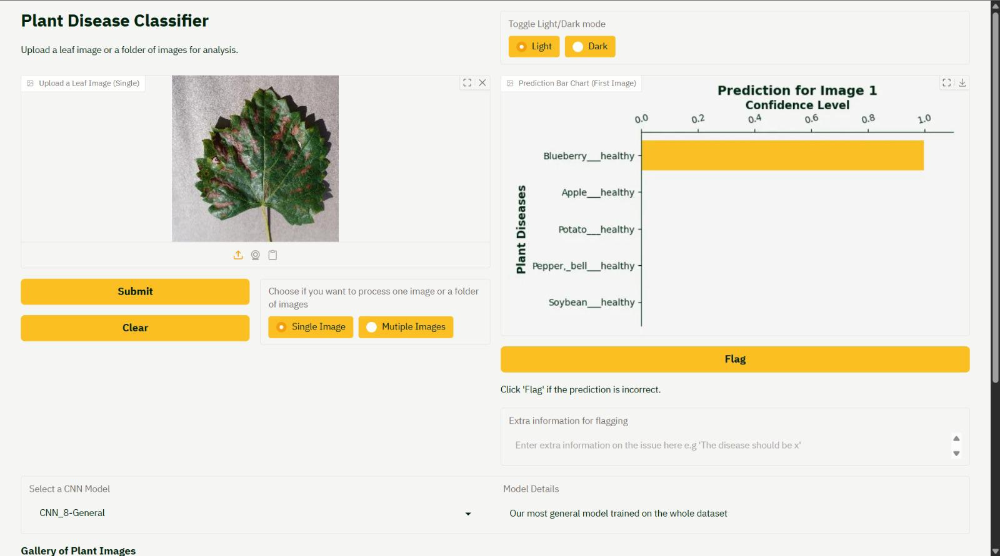
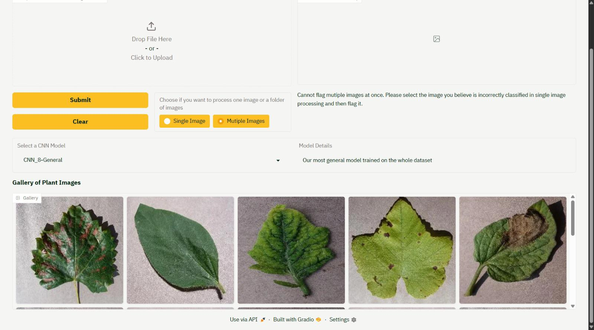
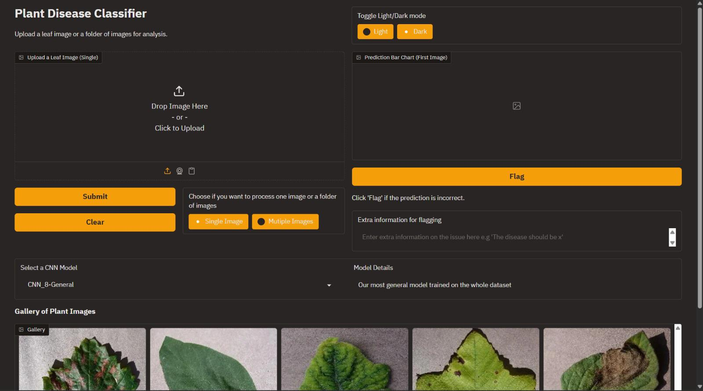
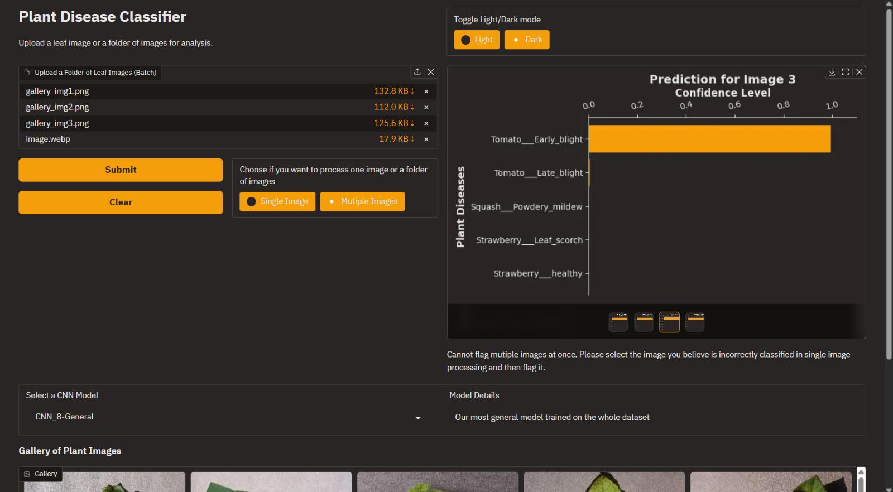

# GAP-Team2

Repository for Team 2 Small Group Project for the 5CCSAGAP module

## Overview

This project is an AI system capable of detecting plant diseases from plant images

Click [here](https://huggingface.co/spaces/CADACADA/5CCSAGAP-Team-2) to check out the deployed version of the app on Hugging Face Spaces!

## Technologies Used for the Project

 - PyTorch for model development
 - ClearML for tracking
 - Gradio for the UI
 - Hugging Face spaces for deployment

## Running the Project Locally

1.  Clone this project locally
2.  Open a terminal 
3.  cd <project_directory>
4.  Run the requirements.txt file
    ```bash
    pip install -r requirements.txt
    ```
5.  Run main.py
    ```bash
    python3 main.py
    ```
6.  Click on the localhost link provided in the terminal
7.  Finally, try out the project


## Features and How to Use them 
 
- **Uploading an Image**
    - Firstly, you will see a box where you are able upload an image.

- **Batch Image Processing**
    - You can choose to upload multiple images of your choice.

- **The User can select multiple models**
    - For example you could pick a model that is specifically trained to detect tomatoes the best or a general model. Each model is accompanied by a description for any extra information.

- **Graphs**
   - As soon as you press submit, you will see a graph for each plant image showcasing their potential plant disease and their corresponding confidence level.

- **Clear button**
    - If you change your mind before submitting an image or any images, the clear button will remove them from the upload section and you can choose again.

- **Flag button**
    - If you believe a plant has been classified incorrectly, then please flag this detection by pressing the flag button and provide any extra information with your concerns so the developers can improve the models for better future detection.

- **Image Gallery**
    - Below you will see a gallery of images of which users have uploaded in the past and you can select any of these and submit them to be detected. 

- **Light and dark mode**
    - Finally, if you have a specific aesthetic preference, feel free customise your view by switching between light and dark mode. This application is in dark mode by default. 
    The graphs will be reloaded to match the theme.

## A Sneak Peak 

<div align="center">
    
    
    
    
</div>


## Credits
Many thanks to 

 - Corinne Agyemang | k23153210@kcl.ac.uk
 - Ali Alharmoodi | k21185545@kcl.ac.uk
 - Karim Bidaoui | k24033682@kcl.ac.uk
 - Fadi Mostefai | k23160103@kcl.ac.uk
 - Elif Noble  | k23168390@kcl.ac.uk

who have developed this project


